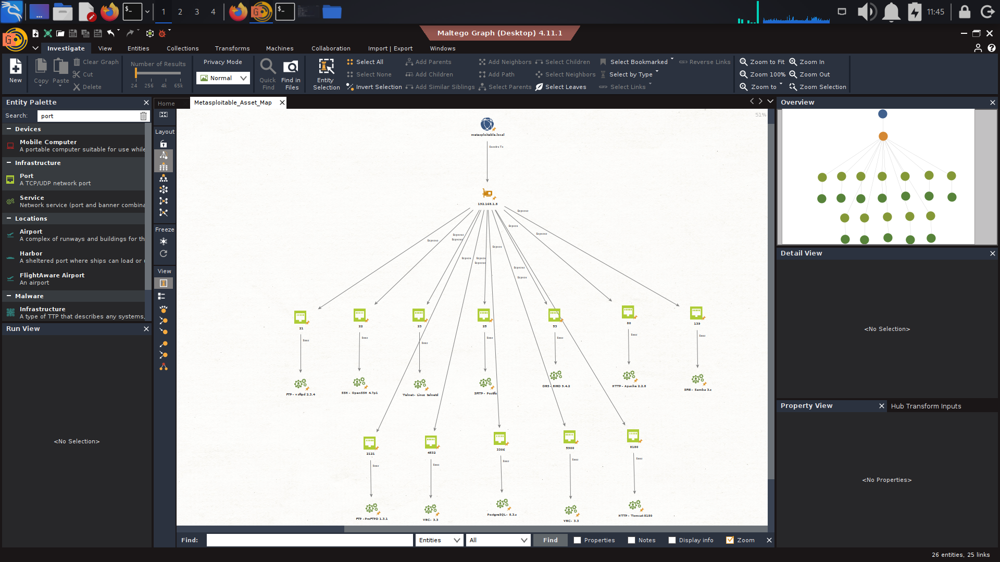
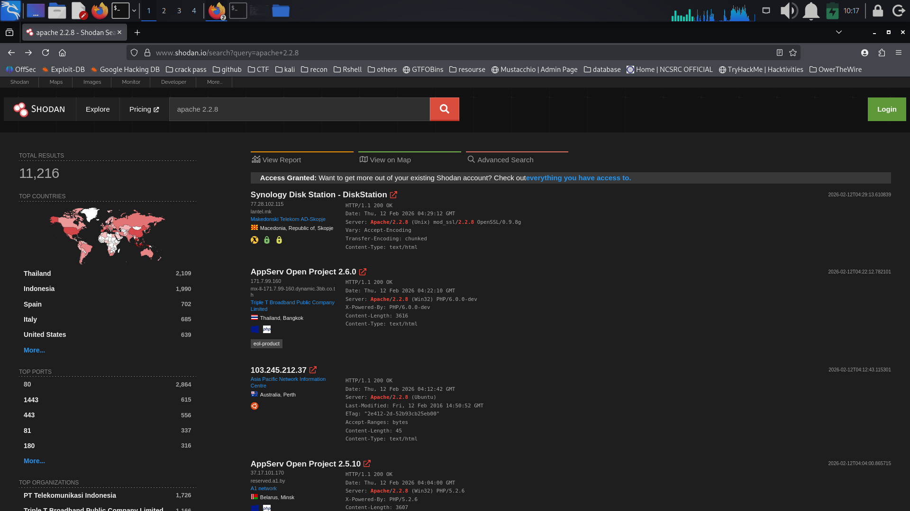
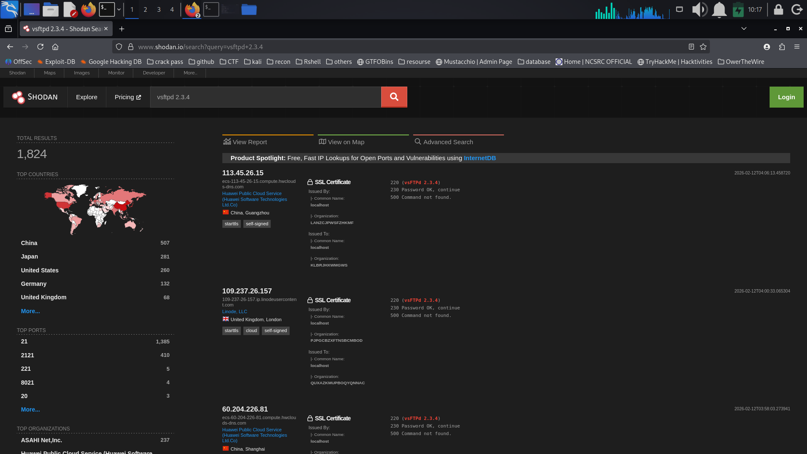

Objective:  
Perform structured reconnaissance on the Metasploitable2 lab target to identify exposed services, outdated software versions, and potential attack vectors before active exploitation.

Tools Used:
Shodan  
Maltego  
Service Banner Analysis  
Methodology

Searched vulnerable versions in Shodan:
apache 2.2.8
vsftpd 2.3.4
Reviewed service banners for version disclosure.
Mapped open ports and services in Maltego.
Correlated findings with known vulnerabilities.

Recon Activity Log
```
+---------------------+----------------+-----------------------------+------------------+
| Timestamp           | Target IP      | Vulnerability / Service     | PTES Phase       |
+---------------------+----------------+-----------------------------+------------------+
| 2026-02-12 10:17:09 | Public Results | Apache 2.2.8 Exposure       | Reconnaissance   |
| 2026-02-12 10:17:44 | Public Results | vsFTPd 2.3.4 Exposure       | Reconnaissance   |
| 2026-02-12 11:45:27 | 192.168.1.100  | Multiple Open Ports Found   | Reconnaissance   |
+---------------------+----------------+-----------------------------+------------------+

Identified Services (Asset Mapping)
+------+---------+------------------+
| Port | Service | Version          |
+------+---------+------------------+
| 21   | FTP     | vsFTPd 2.3.4     |
| 22   | SSH     | OpenSSH 4.7p1    |
| 23   | Telnet  | Linux Telnet     |
| 25   | SMTP    | Postfix          |
| 53   | DNS     | BIND             |
| 80   | HTTP    | Apache 2.2.8     |
| 139  | SMB     | Samba 3.x        |
| 3306 | MySQL   | MySQL 5.x        |
+------+---------+------------------+
```
Key Observations:  
Outdated software versions were identified via OSINT queries.
Version disclosure increases the likelihood of targeted exploitation.
Multiple legacy services running simultaneously expand the attack surface.
FTP and HTTP services present high-value initial access opportunities.

Recon Summary:  
The reconnaissance phase successfully identified vulnerable and outdated services running on the target system. Public intelligence sources confirmed exposure of Apache 2.2.8 and vsFTPd 2.3.4, both historically associated with critical vulnerabilities. Asset mapping revealed multiple exposed ports, significantly increasing the overall attack surface and providing several potential entry points for the next phase.


## Asset Mapping (Maltego)

The target IP (192.168.1.8) was mapped using Maltego to visualize exposed services and port relationships.



*Figure 1: Asset relationship graph showing exposed ports and services.*

---

## OSINT – Apache 2.2.8 Exposure

Shodan search confirmed multiple publicly exposed instances running Apache 2.2.8, a version associated with known vulnerabilities.



*Figure 2: Shodan results identifying Apache 2.2.8 servers.*

---

## OSINT – vsFTPd 2.3.4 Exposure

Shodan reconnaissance revealed exposed vsFTPd 2.3.4 services, a version historically associated with backdoor vulnerabilities.



*Figure 3: Shodan results identifying vsFTPd 2.3.4 servers.*


