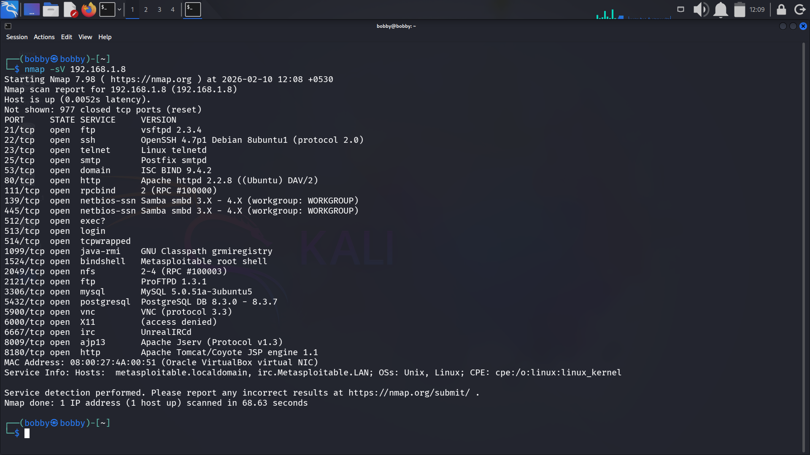
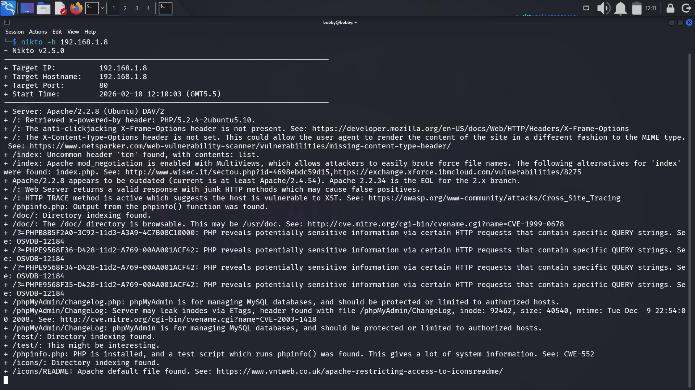
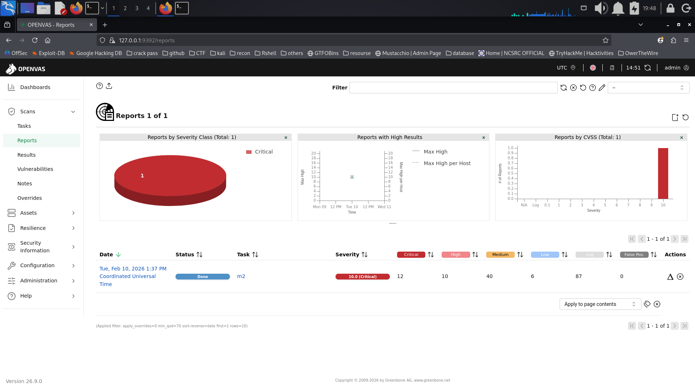
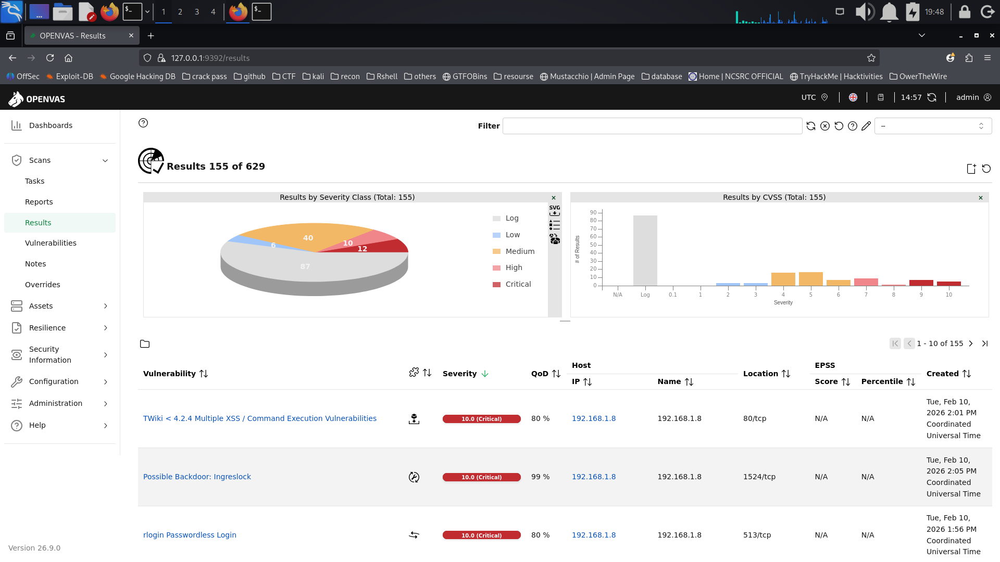
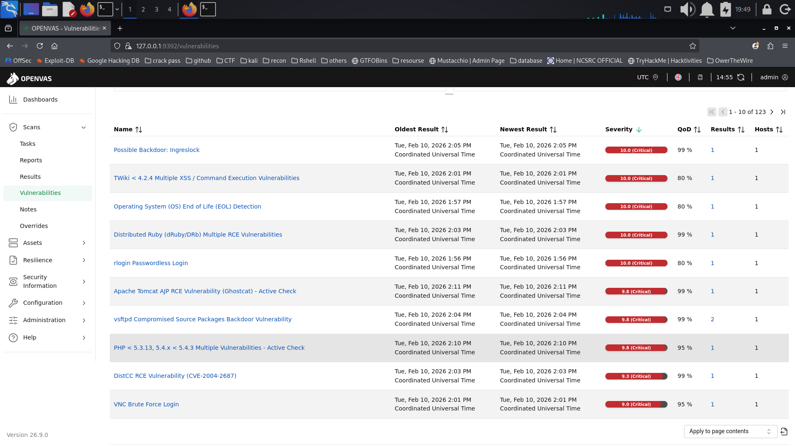
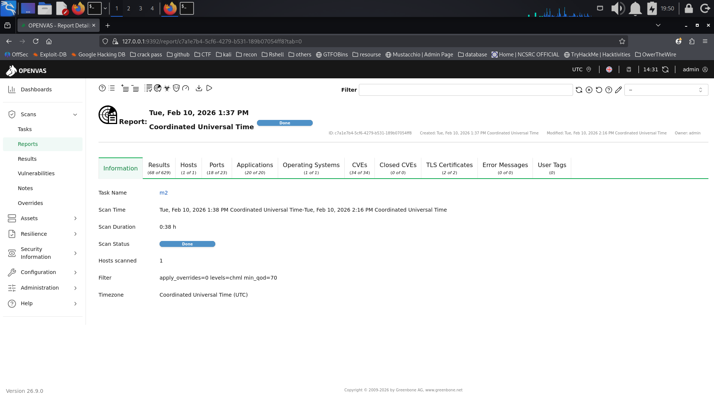

Objective:  
To actively identify open ports, running services, and confirmed vulnerabilities on the target system using automated scanning tools and validate exposure severity.

Target:  
192.168.1.8 (Metasploitable2)

Tools Used:  
Nmap (Service & Version Detection)  
Nikto (Web Server Analysis)  
OpenVAS (Automated Vulnerability Assessment)

Methodology:  
Executed nmap -sV 192.168.1.8 for service enumeration.  
Ran nikto -h 192.168.1.8 to analyze web server misconfigurations.  
Conducted OpenVAS scan for vulnerability scoring and CVE mapping.  
Correlated findings across tools to reduce false positives.  

Nmap Scan Results
```
+------+------------+-------------------------------------------+
| Port | Service    | Version                                   |
+------+------------+-------------------------------------------+
| 21   | FTP        | vsftpd 2.3.4                              |
| 22   | SSH        | OpenSSH 4.7p1 Debian                      |
| 23   | Telnet     | Linux telnetd                             |
| 25   | SMTP       | Postfix smtpd                             |
| 53   | DNS        | ISC BIND 9.4.2                            |
| 80   | HTTP       | Apache httpd 2.2.8 (Ubuntu)               |
| 139  | SMB        | Samba smbd 3.X - 4.X                      |
| 445  | SMB        | Samba smbd 3.X - 4.X                      |
| 3306 | MySQL      | MySQL 5.0.51a                             |
| 8180 | HTTP       | Apache Tomcat/Coyote JSP engine 1.1       |
+------+------------+-------------------------------------------+
```

Observation:  
Large attack surface due to multiple legacy services running simultaneously.

Nikto Web Server Findings
```
+----------------+----------------------------------------------+
| Finding        | Description                                  |
+----------------+----------------------------------------------+
| X-Frame-Opts   | Header missing (Clickjacking risk)          |
| X-Content-Type | Header not set (MIME sniffing risk)         |
| HTTP TRACE     | Enabled (Possible XST vulnerability)        |
| phpinfo()      | Information disclosure                      |
| Directory Index| /doc/, /test/, /icons/ exposed              |
| Apache 2.2.8   | Outdated and End-of-Life                    |
+----------------+----------------------------------------------+
```

Observation:  
Web server misconfigurations significantly increase exposure risk and provide reconnaissance value to attackers.

OpenVAS High-Severity Findings:
```
+---------+--------------------------------------+--------+-----------+--------------+
| Scan ID | Vulnerability                        | CVSS   | Priority  | Host         |
+---------+--------------------------------------+--------+-----------+--------------+
| 001     | vsFTPd 2.3.4 Backdoor                | 10.0   | Critical  | 192.168.1.8  |
| 002     | Apache 2.2.8 (End-of-Life)           | 9.8    | Critical  | 192.168.1.8  |
| 003     | Apache Tomcat AJP RCE (Ghostcat)     | 9.8    | Critical  | 192.168.1.8  |
| 004     | TWiki Multiple XSS / Command Exec    | 10.0   | Critical  | 192.168.1.8  |
| 005     | rlogin Passwordless Login            | 10.0   | Critical  | 192.168.1.8  |
| 006     | HTTP TRACE Enabled                   | 6.5    | Medium    | 192.168.1.8  |
| 007     | Directory Indexing Enabled           | 5.3    | Medium    | 192.168.1.8  |
+---------+--------------------------------------+--------+-----------+--------------+
```

Severity Summary (OpenVAS):  
Critical: 12  
High: 10  
Medium: 40  
Low: 6  
Highest CVSS Score Observed: 10.0 (Critical)

## Business Impact
- Remote Code Execution vulnerabilities could lead to full system compromise.  
- Backdoored FTP service may allow unauthorized shell access.  
- Legacy web services increase risk of exploitation and data breach.  
- Misconfigurations provide attackers with reconnaissance advantages.  

## Remediation Recommendations
- Upgrade Apache to a supported version.
- Remove or disable FTP service if not required.
- Disable HTTP TRACE method.
- Restrict rlogin access.
- Apply security headers (X-Frame-Options, X-Content-Type-Options).
- Patch Tomcat AJP vulnerability.

```
Subject: Critical Vulnerabilities Identified on 192.168.1.8

Dear Development Team,

During the vulnerability assessment, multiple critical issues were identified on the target system (192.168.1.8). Notably, vsFTPd 2.3.4 backdoor exposure and Apache 2.2.8 (End-of-Life) were detected with CVSS scores up to 10.0. Additionally, Apache Tomcat AJP RCE and passwordless rlogin access significantly increase the risk of remote compromise.

Immediate remediation is recommended, including patching outdated services, disabling unnecessary protocols, and applying secure configuration standards.

Please let me know if a detailed technical breakdown or proof-of-concept validation is required.

Regards,
Khush Rupapara
```

```
## Nmap Service Version Scan



---

## Nikto Web Vulnerability Scan



---

## OpenVAS Severity Overview



---

## OpenVAS Results Summary



---

## Critical Vulnerabilities Identified



---

## Scan Configuration & Metadata



```
