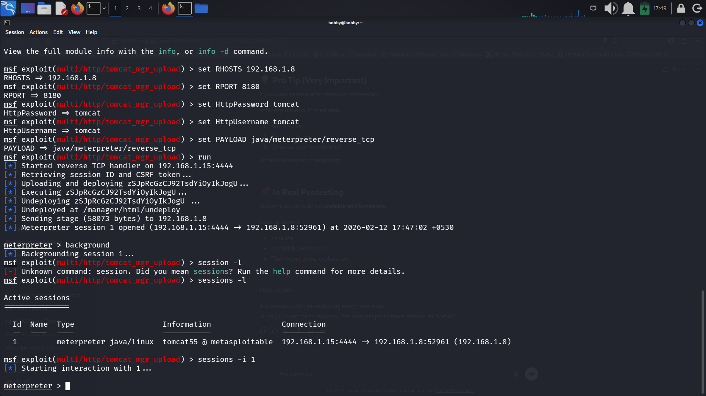
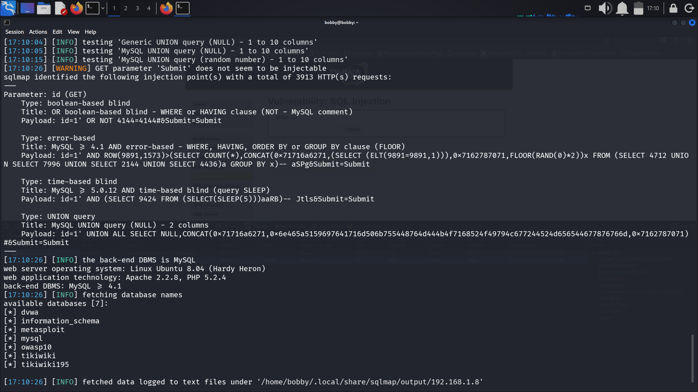
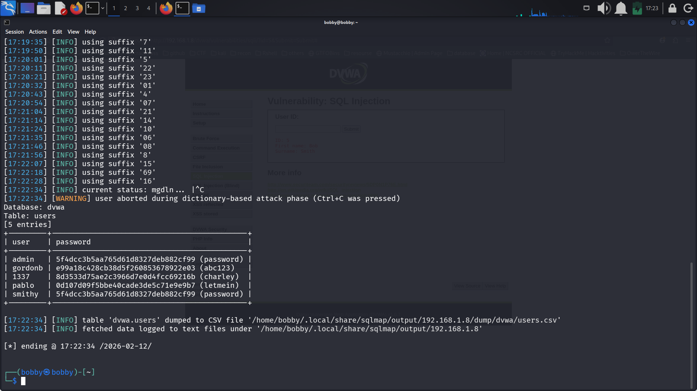

# Full VAPT Cycle Report

---

## 1. Executive Summary

This project simulates a full Vulnerability Assessment and Penetration Testing (VAPT) cycle against a deliberately vulnerable environment (Metasploitable2 & DVWA). The assessment followed a PTES-aligned methodology to identify, validate, and exploit high-risk security weaknesses.

Critical vulnerabilities including SQL Injection and Remote Code Execution (RCE) were successfully identified and exploited. Sensitive database information was extracted, demonstrating real-world impact. Remediation strategies were proposed to mitigate identified risks and reduce overall attack surface.

Overall Risk Rating: **Critical**

---

## 2. Scope & Target

**Target IP:** 192.168.1.8  
**Environment:** Metasploitable2  

**Applications Tested:**
- Apache Tomcat 5.5 (Port 8180)
- DVWA (Damn Vulnerable Web Application)

**Methodology:** PTES-aligned structured assessment  
(Recon → Scanning → Exploitation → Post-Exploitation → Reporting)

---

## 3. Reconnaissance Phase

### Tools Used
- Nmap
- Manual service enumeration

### Findings
- Multiple open ports detected (21, 22, 80, 8180, 3306, etc.)
- Apache Tomcat service exposed
- DVWA web application accessible

### Impact
The attack surface was clearly mapped, confirming multiple exposed services and potential entry points for exploitation.

---

## Reconnaissance Evidence


---

## 4. Vulnerability Scanning Phase

### Tools Used
- OpenVAS
- Nmap service detection

### Identified Issues
- Outdated Apache components
- Web application vulnerabilities
- Exposed high-risk services
- Multiple CVSS 9.8–10.0 findings

### Detection Log
```
+---------------------+-------------+----------------------+--------------+
| Timestamp           | Target IP   | Vulnerability        | PTES Phase   |
+---------------------+-------------+----------------------+--------------+
| 2026-02-12 16:50:00 | 192.168.1.8 | SQL Injection        | Exploitation |
| 2026-02-12 17:00:00 | 192.168.1.8 | Tomcat RCE Exposure  | Exploitation |
+---------------------+-------------+----------------------+--------------+
```

**Risk Level: Critical**

---

## Vulnerability Scanning Evidence


---

## 5. Exploitation Phase

### 5.1 Tomcat Remote Code Execution

**Tool:** Metasploit  
**Module:** exploit/multi/http/tomcat_mgr_upload  
**Payload:** java/meterpreter/reverse_tcp  

### Result
Meterpreter session successfully established.
```
+------------+----------------------+-------------+---------+----------------+
| Exploit ID | Description          | Target IP   | Status  | Payload        |
+------------+----------------------+-------------+---------+----------------+
| 003        | Apache Tomcat RCE    | 192.168.1.8 | Success | JSP Reverse Shell |
+------------+----------------------+-------------+---------+----------------+
```


### Validation
- `whoami` confirmed shell access
- Active session maintained
- Command execution verified

### Impact
Successful remote code execution demonstrates complete compromise of the web application layer.

---

## Tomcat RCE Exploitation Evidence



---

### 5.2 SQL Injection – DVWA

**Tool:** sqlmap  

### Injection Types Confirmed
- Boolean-based blind
- Error-based
- Time-based blind
- UNION-based

### Result
Database enumeration successful.

Extracted:
- Database: dvwa
- Table: users
- Usernames and password hashes dumped

### Impact
Sensitive credential data was exposed, demonstrating high-risk data breach potential and unauthorized database access.

---

## SQL Injection Evidence





---

## 6. Post-Exploitation Findings

- System user compromised: tomcat55
- Database credentials exposed
- Outdated Apache and PHP versions detected
- Multiple attack paths validated

This stage confirmed privilege compromise and sensitive data extraction capability.

---

## 7. Remediation Recommendations

1. Implement parameterized queries (prepared statements)
2. Enforce strict input validation and output encoding
3. Disable or restrict Tomcat Manager via IP allowlist
4. Upgrade Apache, PHP, and MySQL to supported versions
5. Apply least-privilege access controls
6. Close unnecessary open ports
7. Conduct re-scan after patch implementation

---

## 8. Conclusion

The full VAPT cycle demonstrates how structured reconnaissance, vulnerability scanning, and exploitation can lead to complete system compromise. SQL Injection enabled database extraction, while Tomcat misconfiguration allowed remote code execution.

This assessment reinforces the importance of secure coding practices, proactive vulnerability management, and continuous monitoring. Proper remediation significantly reduces attack surface and mitigates privilege escalation risks.

---

## 9. Non-Technical Briefing

This assessment identified critical security weaknesses that allowed unauthorized access to the system. An attacker could execute commands remotely and extract sensitive user credentials. These issues were caused by outdated software and insecure input handling. If left unresolved, they could lead to serious data breaches or full system compromise. Immediate corrective actions include software updates, access restrictions, and secure development practices. A follow-up security assessment is recommended after remediation to ensure vulnerabilities are fully resolved.
